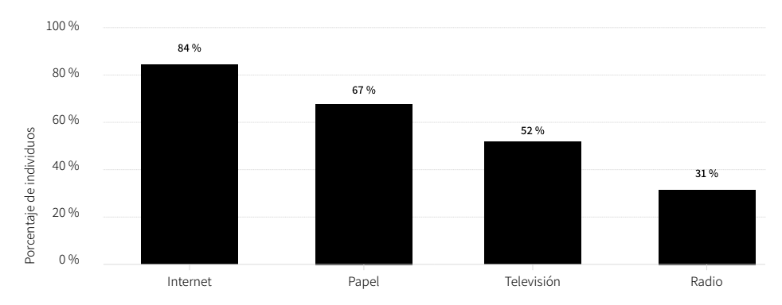
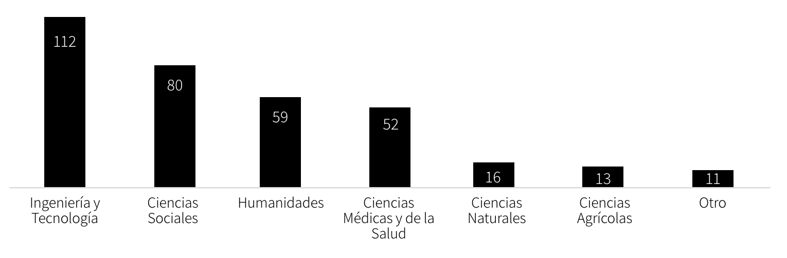

\newpage

\section*{Plan de Negocio}

## 1. Introducción

### 1.1. CNAE (Clasificación Nacional de Entidades Económicas)

Educación.

### 1.2. Misión

Ofrecer una educación personalizada y de alta calidad a través de la tecnología, para que las personas puedan aprender de manera eficiente y efectiva, mejorando la satisfacción de los estudiantes y las tasas de finalización de los cursos.

### 1.3. Visión

Ser la plataforma de educación en línea más grande y reconocida en el mundo, ofreciendo una amplia variedad de cursos y programas adaptados a las necesidades de cada estudiante.

### 1.4. Valores

- Calidad
- Innovación
- Personalización
- Eficiencia
- Ética

\newpage

## 2. Descripción de la Oportunidad de Negocio

El avance tecnológico ha registrado una trayectoria ascendente sin precedentes en las últimas décadas. Este progreso ha catalizado una transformación paralela en el dominio educativo, propulsando el e-learning a un primer plano en la entrega de conocimiento y habilidades. La digitalización de la educación no solo ha democratizado el acceso a la información, sino que también ha ampliado las fronteras del aula tradicional, permitiendo un aprendizaje más flexible y autodirigido.

En el vértice de la crisis sanitaria global, la pandemia de COVID-19 se desempeño como catalizador para una adopción masiva de la educación en línea. El confinamiento y la interrupción de la enseñanza presencial urgieron a una migración acelerada hacia plataformas digitales. Según una encuesta realizada en julio del año 2020 por la escuela de negocios Online Business School (OBS)[^1] de España, el 84% de los 30 países analizados en la región había elegido internet como uno de sus sistemas de educación a distancia. 

{ width=70% }

Posteriormente, una vez atenuado el impacto directo de la pandemia, la inercia del aprendizaje en línea perduró. Muchos estudiantes, ahora acostumbrados al entorno digital, continuaron favoreciendo esta modalidad, apoyados por la escalada tecnológica que seguía enriqueciendo esta experiencia. El impulso continuo del e-learning responde también a una demanda creciente de capacitación constante, vital en un mercado laboral que se reinventa continuamente. Según estimaciones de Global Market Insights, la valuación del mercado de e-learning en $399.3 mil millones de dolares en 2022 y su proyectado crecimiento a una tasa compuesta anual del 14% hasta 2032, subraya esta tendencia.

Sin embargo, el escenario actual de la educación en línea destaca un marcado contraste entre la disponibilidad de recursos educativos y la efectividad de su implementación. La mayoría de las plataformas digitales persisten en ofrecer programas estandarizados, con falta de la flexibilidad necesaria para atender las demandas personalizadas de aprendizaje. Esta homogeneización del contenido pedagógico conlleva a deficiencias en la retención de conocimientos por parte de los estudiantes, evidenciado por las tasas de finalización de cursos que, de manera preocupante, suelen rondar el 10%[^2]. Tal fenómeno no solo sugiere una desconexión entre la instrucción y la diversidad de estilos de aprendizaje, sino que también plantea el riesgo de desaprovechar el potencial académico de estudiantes que requerirían una metodología más ajustada a sus particularidades. Este desafío en el panorama educativo actual subraya la necesidad de una plataforma de aprendizaje electrónico que privilegie la adaptabilidad y personalización en su oferta curricular, alineándose estrechamente con las aptitudes y aspiraciones individuales de cada estudiante.

No obstante, investigaciones recientes del año 2023 realizadas por la Online Business School (OBS)[^3] de España anticipan un aumento significativo en las inscripciones a programas en línea, destacando el ámbito de la tecnología con un crecimiento proyectado del 33% en los próximos cinco años. Esta tendencia subraya una oportunidad primordial para desarrollar cursos en línea especializados en tecnología. A continuación, se incluye una figura que ilustra detalladamente estos hallazgos, fundamentando la viabilidad y el potencial de esta iniciativa.

{ width=70% }

En conclusión, la rápida evolución tecnológica y la transformación del paisaje educativo presentan una oportunidad singular para innovar en la entrega de educación en línea. La persistencia de desafíos, como la estandarización excesiva y la baja tasa de finalización de cursos, no solo destaca las deficiencias en las plataformas actuales sino que también subraya el potencial para una plataforma que ofrezca soluciones personalizadas y adaptativas. Aprovechando las tendencias emergentes y las necesidades cambiantes del mercado laboral, se revela un campo fértil para el desarrollo de una oferta educativa que no solo mejore la experiencia del aprendizaje digital sino que también incremente la efectividad del mismo. Con el respaldo de datos y proyecciones que auguran un crecimiento robusto en la demanda de educación técnica en línea, nuestro proyecto está posicionado estratégicamente para liderar esta próxima ola de innovación educativa, asegurando que la educación en línea sea más accesible, relevante y fructífera para todos los estudiantes.

[^1]: FUENTE: [OBS Business School -El Estudiante Universitario en Línea. Tendencias y Perspectivas.](https://marketing.onlinebschool.es/Prensa/Informes/Informe%20OBS%20E-learning%202022.pdf)

[^2]: FUENTE: [fastercapital.com](https://fastercapital.com/es/contenido/Tasas-de-retencion-de-cursos--Tasas-de-retencion-de-cursos--una-metrica-clave-para-el-exito-del-marketing.html)

[^3]: FUENTE:[OBS Business School - Tendencias y Percepciones sobre la Educación en Línea y la Adopción de Tecnologías Educativas](https://www.obsbusiness.school/sites/obsbusiness.school/files/media_files/Informe%20OBS%20E-Learning%202023.pdf)

\newpage

## 3. Entrevista Problema

### 3.1 Preguntas

- ¿Cuál es tu edad?
  a. Menos de 17 años
  b. Entre 17 y 25 años
  c. Mayor a 25 años

- ¿Estás actualmente estudiando?
  a. Si
  b. No

- ¿Cuál es tu nivel educativo actual?
  a. Primaria
  b. Secundaria
  c. Universitaria
  d. Postgrado
  e. otra

- ¿Qué dificultades has enfrentado con los métodos de enseñanza que frecuentas?
  a. Falta de personalización
  b. Ritmo de aprendizaje inadecuado
  c. Dificultad para entender el contenido
  d. No he enfrentado dificultades
  e. Otra

- ¿Consideras que tus necesidades individuales de aprendizaje están siendo satisfechas?
  a. Si
  b. No

- ¿Que opinas de la IA?
  a. No me gusta, prefiero hacer las cosas a mi manera.
  b. Lo uso de vez en cuando.
  c. Me parece estupenda la IA, y aprovecho mucho su capacidad.

- ¿Has utilizado plataformas de educación en línea?
  a. Si
  b. No
  
- En general,  ¿terminas tus cursos?
  a. Si, termino todos los cursos que comienzo.
  b. Varios me quedaron incompletos.
  c. Nunca logro completarlos.
  
- Si tu respuesta no fue la Opcion 1,  ¿por que crees que no lograste terminar determinados cursos?

- Ahora responde teniendo en cuenta lo siguiente:
  Nosotros nos especializamos en ofrecer una plataforma de educación en línea altamente sofisticada,     diseñada para brindar un aprendizaje personalizado y de calidad superior. Nuestra plataforma se distingue por su enfoque en la adaptabilidad, permitiendo que cada usuario reciba una experiencia educativa adaptada a sus preferencias y ritmos individuales de aprendizaje. Desde la selección de contenido hasta la interacción con instructores, nuestro objetivo es garantizar que cada estudiante pueda alcanzar su máximo potencial de manera efectiva y satisfactoria.
  
- Sabiendo que nuestra plataforma se encuentra preparada con IA para resolver esos problemas, ¿que tan probable seria que te subscribas mensualmente?
  a. 1
  b. 2
  c. 3
  d. 4
  e. 5
  
- ¿Que caracteristicas buscas en una plataforma de educacion en linea?

- ¿Como te gustaria interactuar con la IA en nuestra plataforma?
  a. Recomendaciones personalizadas
  b. Asistentes virtual
  c. Adaptacion de ritmo y dificultad
  d. Todas las anteriores
  
- ¿Cuánto estarías dispuesto/a a pagar mensualmente en tu educación en línea?
  a. De 1€ a 15€ 
  b. De 15€ a 50€
  c. De 50€ a 100€
  d. Más de 100€

- ¿Tienes alguna sugerencia para mejorar nuestra aplicacion?

- ¿Recomendarias la aplicacion?
  a. Si
  b. No

### 3.2 Resultados
##################FALTA COMPLETAR########################

\newpage

## 4. Mapa de Empatia

### 4.1. ¿Qué ve? 

Ve desafíos académicos en sus cursos estándar, diferentes estilos de aprendizaje y la necesidad de obtener buenos resultados académicos.

### 4.2. ¿Qué escucha? 

Escucha la frustración de otros estudiantes por la falta de personalización en la enseñanza, a profesores sobre el contenido estándar del curso.
   
### 4.3. ¿Qué piensa y siente? 

Piensa en aprender de manera más efectiva, siente frustración cuando no puede seguir el ritmo del curso y se preocupa por su desempeño académico y su futuro profesional.
   
### 4.4. ¿Qué dice y hace? 

Expresa su deseo de cursos más adaptados, busca recursos adicionales para aprender y participa en grupos de estudio o busca ayuda de compañeros de clase.
   
### 4.5. ¿Cuáles son sus problemas y necesidades? 

Necesita una educación que se adapte a su estilo de aprendizaje y ritmo, obtener buenos resultados académicos y herramientas para comprender mejor los temas difíciles.
   
### 4.6. ¿Qué le motiva? 

La motivación para obtener un título universitario y tener éxito profesional, aprender nuevas habilidades y superar los desafíos académicos.

\newpage

## 5. Lienzo de Propuesta de Valor

### 5.1. Tareas del cliente

Los clientes buscan obtener información precisa y actualizada, adquirir habilidades prácticas aplicables y aprender de manera flexible. Esto implica buscar y seleccionar cursos, inscribirse en ellos, gestionar su progreso, interactuar con el contenido, participar en evaluaciones, comunicarse con profesores, colaborar con otros estudiantes y establecer conexiones. Además, desean mantenerse motivados, desarrollar confianza en su capacidad y experimentar un sentido de logro al completar cursos y alcanzar metas personales.

### 5.2. Penas del Cliente

Los clientes pueden enfrentar diversas dificultades al utilizar otra plataforma, como la frustración por la navegación complicada o la dificultad para encontrar información específica. También pueden experimentar preocupación por la sobrecarga de información, temores relacionados con costos ocultos y la insatisfacción con la calidad del contenido.

### 5.3. Alegrías del Cliente

Nuestra plataforma ofrece varias ventajas y alegrías para los clientes. Estos incluyen el ahorro de tiempo y dinero, y la comodidad. También, la satisfacción de encontrar contenido relacionado con los intereses y necesidades del cliente. Además, encontrarán gratificación personal al alcanzar metas educativas y profesionales.

### 5.4. Bienes y Servicios

Ofrecemos una amplia gama de servicios y recursos para satisfacer las necesidades educativas de nuestros clientes. Esto incluye una variedad de cursos en línea en el área de la tecnología, impartidos por expertos en la materia, una plataforma intuitiva y fácil de usar con herramientas interactivas para facilitar el aprendizaje, y un sólido soporte técnico y académico. Además, nos comprometemos a mantener el contenido actualizado y a mejorar continuamente nuestra oferta educativa.

### 5.5. Creadores de Alegrías

Nuestro equipo se esfuerza por crear una experiencia educativa positiva y enriquecedora para nuestros clientes. Esto implica ofrecer flexibilidad en términos de horarios y ubicación, así como la posibilidad de personalizar el aprendizaje según las preferencias individuales. También nos comprometemos a proporcionar una amplia variedad y calidad de contenido educativo, una interfaz intuitiva y fácil de usar, y una comunidad de apoyo activa para enriquecer la experiencia de aprendizaje.

### 5.6. Quitapenas

Nos esforzamos por abordar las preocupaciones y dificultades que pueden surgir al utilizar nuestra plataforma. Esto incluye mejorar la interfaz y la experiencia del usuario para hacerla más intuitiva y fácil de usar, así como garantizar la transparencia en los costos y ofrecer un soporte ampliado. Además, valoramos el feedback de nuestros usuarios y nos comprometemos a realizar mejoras continuas para satisfacer sus necesidades y expectativas en términos de calidad y relevancia educativa.

\newpage

## 6. Modelo de Negocio

### 6.1. Socios clave 

- Educadores y universidades que proveen cursos y material didáctico.
- Especialistas en tecnología que respaldan la infraestructura de la plataforma, incluyendo inteligencia artificial para personalización del aprendizaje.
- Organizaciones de Certificación que validan y dan prestigio a los certificados ofrecidos por los cursos completados en la plataforma.
- Fuentes financieras que apoyan la sostenibilidad y expansión de la plataforma.

### 6.2. Actividades clave

- Actualización de Contenidos: Evaluación y selección de materiales educativos que se alineen con las necesidades de los usuarios.
- Marketing y Promoción: Estrategias de marketing digital para atraer a nuevos usuarios y retener a los existentes.
- Soporte y Servicio al Cliente: Asistencia continua a usuarios para resolver problemas técnicos o dudas académicas.

### 6.3. Recursos Clave

#### 6.3.1. Tangibles

- Físicos: Infraestructura de hardware necesaria para soportar y alojar la plataforma de educación en línea, como servidores potentes, equipos de cómputo y sistemas de almacenamiento de datos. 
- Económicos-financieros: Capital necesario para mantener la plataforma, promocionar el servicio educativo y pagar al equipo humano. 

#### 6.3.2 Intangibles 

- Equipo Humano: Un equipo de profesionales que incluye desarrolladores web, creadores de contenido, especialistas en marketing, personal de soporte y personal educativo.
- Asistencia personal: Ofrecer asistencia individualizada para resolver dudas o problemas técnicos.
- Comunidad de Aprendizaje: Crear foros y redes sociales donde los estudiantes puedan interactuar entre sí.
- Creación colectiva: Obtener y actuar en base a las opiniones y sugerencias de los usuarios para mejorar continuamente la plataforma y crear valor.

### 6.4. Canales

#### 6.4.1. Tipo de canal

- Sitio Web Oficial: El principal punto de acceso a los cursos y recursos de la plataforma.

#### 6.4.2. Fase de canal

1. Información: promoción en redes sociales, eventos y conferencias online. 
2. Evaluación: Descuentos en inscripción a cursos.
3. Compra: A través de nuestra página web. 
4. Entrega: A través de la personalización de cursos en la página web.
5. Postventa: Soporte y foros de consulta con profesores.

### 6.5. Segmento de clientes

Nuestro objetivo es crear valor para cualquier individuo que busque mejorar sus habilidades, conocimientos y perspectivas a través de una experiencia educativa en línea personalizada y de alta calidad.
En específico, estudiante, profesionales en busca de capacitación y personas interesadas en aprendizaje personalizado.

### 6.6. Estructura de costos

#### 6.6.1. Costos Fijos

**Costos de Instalaciones, Medios y Equipos**

- Servidores de Alta Capacidad
- Red de Internet de Alta Velocidad

#### 6.6.2. Costos Variables

**Gastos de Marketing y Publicidad**

- Facebook Ads
- Instagram Ads
- Google Ads

#### 6.6.3. Economías de escala

A medida que aumenta el volumen de usuarios y cursos, es posible lograr economías de escala en áreas como desarrollo de plataforma, adquisición de contenido y marketing, lo que reduce los costos unitarios.

### 6.7. Fuentes de ingreso

Nuestro principal flujo de ingresos proviene de las suscripciones de los clientes, quienes acceden a nuestra plataforma para beneficiarse de nuestros cursos en línea.

\newpage

## 7. Organización: Organigrama y equipo promotor

### 7.1. Organigrama

{ width=100% }

### 7.2. Equipo Promotor

**Azul Noguera** *Estratega Principal (CEO)*

- Experiencia: Más de 10 años en el sector de la educación y la tecnología, incluyendo roles de dirección en empresas de e-learning.
- Habilidades Clave: Liderazgo estratégico, visión empresarial, gestión de equipos multidisciplinarios, desarrollo de negocios.
- Funciones Asignadas: Toma de decisiones estratégicas, representación ante terceros, planificación general del negocio.

**Patricio Guledjian** *Director de Tecnología (CTO)*

- Experiencia: Ingeniero informático con 8 años de experiencia en desarrollo web y aplicaciones tecnológicas para la educación.
- Habilidades Clave: Desarrollo de software, gestión de infraestructura tecnológica, implementación de inteligencia artificial.
- Funciones Asignadas: Supervisión del desarrollo de la plataforma, implementación de tecnologías avanzadas, garantía de calidad y seguridad.

**Rocio Gonzalez Cingolani** *Directora de Contenido Educativo (CCO)*

- Experiencia: Pedagoga con 12 años de experiencia en diseño curricular y desarrollo de material educativo.
- Habilidades Clave: Creación de contenido didáctico, adaptación curricular, evaluación de aprendizaje.
- Funciones Asignadas: Supervisión de la calidad del contenido, selección de cursos y materiales, asegurando el cumplimiento de estándares pedagógicos.

\newpage

**Rafael Cabre** *Director de Marketing y Ventas (CMO)*

- Experiencia: Profesional en marketing con 7 años de experiencia en estrategias digitales y promoción de servicios educativos.
- Habilidades Clave: Marketing digital, gestión de campañas publicitarias, análisis de mercado, desarrollo de marca.
- Funciones Asignadas: Planificación y ejecución de estrategias de marketing, captación de usuarios, análisis de datos y rendimiento.

**Ian Costantini** *Director Financiero (CFO)*

- Experiencia: Contador público con más de 15 años de experiencia en finanzas corporativas y gestión financiera.
- Habilidades Clave: Análisis financiero, planificación presupuestaria, gestión de inversiones, obtención de financiamiento.
- Funciones Asignadas: Elaboración de presupuestos, gestión de flujo de caja, análisis de rentabilidad, negociación con inversores y entidades financieras.

**Lucila Chaves** *Jefa de Recursos Humanos (HR)*

- Experiencia: Especialista en recursos humanos con más de 13 años de experiencia en reclutamiento, capacitación y desarrollo del talento en empresas tecnológicas y educativas.
- Habilidades Clave: Gestión de recursos humanos, desarrollo organizacional, legislación laboral, comunicación interna.
- Funciones Asignadas: Dirección de las políticas de recursos humanos, reclutamiento y selección de personal, desarrollo y capacitación de empleados, mantenimiento de un ambiente laboral positivo y productivo.

\newpage

## 8. Analisis entorno competitivo

### 8.1. Empresas las cuales se dediquen a la misma actividad o parecida a la nuestra

a. Coursera[^4]

b. Udemy[^5]

c. Duolingo[^6]

[^4]: FUENTE: [coursera.org](https://www.coursera.org/)
[^5]: FUENTE: [udemy.com](https://www.udemy.com/)
[^6]: FUENTE: [es.duolingo.com](https://es.duolingo.com/)

### 8.2. Descripcion de la competencia y producto

a. Coursera, fundada en octubre de 2011 por académicos de la Universidad de Stanford, es una destacada plataforma de educación en línea diseñada para ofrecer cursos masivos abiertos en línea (MOOC, por sus siglas en inglés). Actualmente, proporciona 3,943 cursos de pago que abarcan una amplia gama de disciplinas—desde idiomas y matemáticas hasta tecnología, salud, desarrollo personal, ciencias, artes y humanidades—, todos impartidos por universidades de prestigio mundial y acompañados de certificaciones reconocidas como el Mastertrack Certificate. La inscripción tiene un costo mensual de 54 dólares estadounidenses, y la plataforma no ofrece reembolso por la matrícula.
Sin embargo, una de las principales críticas hacia Coursera radica en su limitada personalización: la plataforma tiende a ofrecer contenido pregrabado que incluye ejercicios de opción múltiple sin revisión posterior, lo que puede no satisfacer a usuarios que buscan una experiencia de aprendizaje más interactiva y adaptada a sus necesidades específicas. Este aspecto representa una oportunidad significativa para competidores que puedan integrar sistemas de aprendizaje más dinámicos y personalizados.

b. Udemy es una prominente plataforma de e-learning establecida en 2010 en San Francisco, California, EE. UU. Dedicada primordialmente a profesionales adultos, Udemy se distingue por ofrecer una extensa variedad de cursos en áreas como Desarrollo, Negocios, Informática y Software, Productividad en la Oficina, Desarrollo Personal, Diseño, Marketing, Estilo de Vida, Fotografía, Salud y Fitness, Música, y Enseñanzas Académicas.  
A diferencia de los tradicionales MOOC desarrollados por universidades, Udemy permite a los creadores independientes desarrollar, promocionar y monetizar sus cursos, proporcionándoles herramientas esenciales para gestionar y obtener ingresos a través de las matrículas. Aunque los cursos de Udemy no equivalen a títulos universitarios, son ampliamente reconocidos por mejorar habilidades profesionales y personales. La plataforma ofrece los cursos a un precio mensual de $10.99 USD y garantiza una política de reembolso de 30 días.  
Sin embargo, al igual que Coursera, Udemy carece de personalización en la experiencia del usuario y ofrece contenidos que no requieren una interacción profunda o retroalimentación detallada en las actividades, lo que puede limitar la profundidad del aprendizaje y la adaptación a las necesidades específicas del estudiante.

c. Duolingo, fundada en 2011 por el profesor Luis von Ahn y su estudiante Severin Hacker en Pittsburgh, Pensilvania, se ha consolidado como una plataforma líder en el aprendizaje de idiomas. Conocida por su enfoque gamificado y accesible, Duolingo ofrece cursos en más de 30 idiomas, desde ampliamente hablados como el inglés, español y francés, hasta idiomas menos comunes como el gaélico escocés y el hawaiano, con una suscripción mensual de 7.33 dólares sin posibilidad de reembolso.  
La plataforma se distingue por la efectividad y la conveniencia de su modelo educativo, que integra el aprendizaje en la rutina diaria de los usuarios de una manera atractiva y divertida. Con millones de usuarios activos a nivel mundial, Duolingo se mantiene como una de las aplicaciones más prominentes y estimadas en el sector del e-learning de idiomas.  
Las lecciones de Duolingo, conocidas por su brevedad, utilizan una variedad de ejercicios interactivos que están diseñados para mejorar habilidades lingüísticas como la lectura, escritura, comprensión auditiva y expresión oral. Cada lección incluye elementos de juego, tales como puntos de experiencia, niveles y vidas, que motivan a los usuarios a mantener un aprendizaje continuo y comprometido. Aunque Duolingo es ideal para quienes buscan dar sus primeros pasos en un nuevo idioma mediante cursos básicos presentados de forma lúdica, puede no cubrir necesidades avanzadas de aprendizaje lingüístico.

| Empresa | fundación | mercados |cursos | reembolso | contenido                  | certificaciones | Cliente objetivo      |
|---------|-----------|----------|-------|-----------|----------------------------|-----------------|-----------------------|
| udemy   | 2010      | mundial  | 67561 | si        | amplia gama de disciplinas | no              | adultos profesionales |
|coursera | 2011      | mundial  | 3943  | no        | amplia gama de disciplinas | si              | cualquier edad        |
|duolingo | 2011      | mundial  | 3880  | no        | idiomas                    | no              | cualquier edad        |

#### 8.2.1 Precio
por dolares EEUU

| Empresa   | Precio mensual |
|-----------|----------------|
| Coursera  | $ 54           |
| Udemy     | $ 15           |      
| Duolingo  | $ 7.33         |

#### 8.2.2 Ingresos y beneficios.    

##### Ingresos Operativos (facturación): por mil dolares EEUU

| Year | Coursera        | Udemy          | Duolingo       |
|------|-----------------|----------------|----------------|
| 2023 | 635,764         | 728,937		    | 531,109 	     |
| 2022 | 523,756         | 629,097        | 369,495        | 
| 2021 | 415,287         | 515,657        | 250,772        |
| 2020 | 293,511         | 429,899        | 161,696        |
| 2019 | 184,411         | 276,327        | 70,760         |

##### Beneficios: por mil dolares EEUU

| Year | Coursera   | Udemy     | Duolingo  |
|------|------------|-----------|-----------|
| 2023 | -111,183   | -107,294	| 16,067		|
| 2022 | -170,637   | -153,875  | -59,574   | 
| 2021 | -143,089   | -80,026   | -60,135   |
| 2020 | -65,300    | -77,620   | -15,776   |
| 2019 | -46,001    | -69,703   | -13,554   |

\newpage

#### 8.2.3 Número de empleados.

| Year   | Cousera   | Udemy     | Duolingo  |
|--------|-----------|-----------|-----------|
| 2023   | 1,295     | 1,443     | 720       |
| 2022   | 1,401     | 1,678     | 600       |
| 2021   | 1,138     | 1,238     | 500       |
| 2020   | 779       | 1,013     | 400       |
| 2019   | n.a.      | n.a       | n.a       |

\newpage

## 9. Definición del mercado 

### 9.1. Cliente objetivo

Nuestro servicio está diseñado para ofrecer formación complementaria a estudiantes universitarios y profesionales que buscan especializarse en el área tecnológica. Para definir con mayor precisión nuestro mercado objetivo, nos centraremos en estudiantes universitarios de España que estén interesados en cursos personalizados y adaptados a sus necesidades de aprendizaje. Esta estrategia nos permitirá identificar y cuantificar de manera efectiva a nuestro público objetivo, asegurando que nuestros cursos respondan específicamente a las demandas y expectativas de este segmento de mercado. Además, estaremos posicionados para satisfacer las necesidades educativas actuales y futuras de los estudiantes universitarios, ayudándoles a complementar sus estudios con habilidades técnicas relevantes y actualizadas.

### 9.2. Métricas

Basándonos en el estudio de mercado realizado con la encuesta mencionada anteriormente, hemos obtenido una serie de resultados que proporcionan información clave para abordar diferentes aspectos del negocio.

**Métrica de Referencia**

Para obtener esta métrica, evaluamos las respuestas de los usuarios en nuestra encuesta, donde les preguntamos si recomendarían nuestro producto. Los resultados mostraron que el 30% de los encuestados expresaron una disposición a recomendar un servicio similar al nuestro.

Además, es relevante destacar que el 63.3% de los encuestados indicaron que podrían recomendar el servicio ("Tal vez"), mientras que el 6.7% indicó que no estaría dispuesto a recomendarlo. Estos datos nos brindan una visión integral de la percepción de los usuarios hacia nuestro servicio y nos ayudan a entender las áreas donde podemos mejorar para aumentar la tasa de recomendación.

**Métrica de Recurrencia**

La métrica de recurrencia es esencial para evaluar la fidelidad y retención de nuestros clientes en un modelo de suscripción mensual. Calculamos esta métrica considerando que cada cliente que adquiere nuestra suscripción mensual la renueva durante un mínimo de un año, lo que equivale a un total de 12 renovaciones en ese periodo.

Esta tasa de recurrencia de 12 por usuario indica que, en promedio, cada cliente generará ingresos equivalentes a 12 meses de suscripción durante el primer año de su relación con nuestro servicio. Este indicador es crucial para la planificación financiera y para comprender el valor del ciclo de vida del cliente en nuestro modelo de negocio basado en suscripciones mensuales. Esta métrica nos permite estimar la estabilidad y el potencial de ingresos a largo plazo derivados de nuestros clientes recurrentes.

### 9.3. Estudio de mercado

**Precio**

Nuestro análisis exhaustivo del mercado ha revelado que nuestro servicio se distingue de la competencia por ofrecer una combinación única de cursos personalizados y un sólido soporte que incluye una retroalimentación constante.

Lo que nos diferencia significativamente de plataformas como Coursera, Udemy y Duolingo es la atención personalizada que brindamos a nuestros usuarios. Nuestros cursos están diseñados para complementar los estudios universitarios, adaptándose a las necesidades específicas de cada estudiante. Esto se traduce en un mayor valor percibido por parte de nuestros clientes, quienes valoran la relevancia y utilidad de nuestros contenidos en su trayectoria académica.

Además, nuestro servicio ofrece un sólido respaldo a través de una interacción constante. Proporcionamos ayuda y feedback continuo a nuestros usuarios, asegurando que puedan maximizar su experiencia de aprendizaje y obtener resultados concretos en su formación.

Por esta razón, hemos decidido estipular un precio de $60 dólares estadounidenses mensuales para la suscripción a nuestro servicio. 

### 9.4. TAM (Mercado Total)

Nuestro mercado total (TAM) se define por la cantidad de estudiantes universitarios en España que podrían beneficiarse de nuestra oferta de formación complementaria y especializaciones.

Según datos del Ministerio de Universidades de España para el curso académico 2022-2023, podemos observar la siguiente distribución de estudiantes: [^7]

| Nivel de estudio        | Cantidad de estudiantes |
|-------------------------|-------------------------|
| Grado y ciclo           |               1.353.347 |
| Master                  |                 276.518 |
| Doctorado               |                  92.382 |
| Total                   |           **1.722.247** |

[^7]: FUENTE: [Ministerio de Universidades de España](https://www.universidades.gob.es/wp-content/uploads/2023/06/Principales-resultados_EEU_2022-23.pdf)

Estos números representan la base potencial de clientes a los que podemos dirigirnos con nuestro servicio educativo. Esta información respalda nuestra estrategia de mercado y nos proporciona una visión clara del alcance y la oportunidad dentro del sector universitario español.

### 9.5. SAM (Mercado Objetivo)

Para determinar nuestro SAM (Servicio Total Disponible), utilizamos los resultados de encuestas exhaustivas que nos proporcionaron una estimación realista del porcentaje de alumnos universitarios dispuestos a consumir nuestro servicio. A partir de estos datos, identificamos que aproximadamente el 80% de los encuestados mostraron disposición a pagar el precio que hemos establecido.

Basándonos en esta información, calculamos nuestro mercado objetivo inicial tomando el total de estudiantes universitarios en España, que es de 1.722.247, y aplicando el porcentaje de disposición a pagar (42.1%). Por lo tanto, nuestro SAM se estima en 1.722.247 x 42.1% = 725.065 potenciales usuarios.
Este cálculo nos proporciona una base sólida para comprender la demanda inicial de nuestro servicio entre los estudiantes universitarios en España que valoran la formación complementaria y especializada que ofrecemos. Estamos enfocados en capturar una parte significativa de este mercado objetivo inicial, aprovechando la disposición de la mayoría de los estudiantes encuestados a invertir en nuestra propuesta de valor.

### 9.6. SOM (Mercado Obtenible)

El mercado obtenible de nuestra startup se define por la capacidad técnica de nuestra infraestructura para atender de manera efectiva a estudiantes universitarios interesados en nuestros servicios de formación complementaria. Esta métrica se basa en la capacidad de nuestros servidores y el ancho de banda disponible.

**Capacidad de Servidores**

Para determinar nuestro mercado obtenible, evaluamos la capacidad de nuestros servidores para manejar el tráfico y la carga de trabajo asociada con la entrega de nuestros cursos en línea. Actualmente, utilizamos tres servidores HP ProLiant ML350 Gen10 con procesadores Intel Xeon Gold 5218R y 32GB de RAM para alojar nuestra plataforma educativa.

- Capacidad de Red: Nuestros servidores están equipados con tarjetas de red Gigabit Ethernet integradas que admiten velocidades de red estándar de 1 Gbps (Gigabit por segundo).

**Ancho de Banda**

El ancho de banda disponible es crucial para garantizar una experiencia de usuario fluida y sin interrupciones durante el acceso a nuestros cursos en línea. Según los requisitos estimados[^8], cada estudiante necesita aproximadamente 2,5 Mbps de ancho de banda para acceder de manera efectiva a nuestros cursos.

[^8]: FUENTE: [GoTo](https://support.goto.com/es/joinme/help/what-are-the-bandwidth-requirements)

**Estimación del SOM**

Basándonos en las especificaciones de nuestra infraestructura técnica, podemos estimar nuestro mercado obtenible considerando el ancho de banda disponible en nuestros servidores.

\[
\text{Ancho de Banda Disponible} = 1000 \text{ Mbps}
\]

\[
\text{Ancho de Banda Requerido por Estudiante} = 2.5 \text{ Mbps}
\]

\[
\text{Número de Estudiantes por Servidor} = \frac{\text{Ancho de Banda Disponible}}{\text{Ancho de Banda Requerido por Estudiante}} = \frac{1000}{2.5} = 400
\]

\[
\text{Número Total de Estudiantes (SOM)} = \text{Número de Estudiantes por Servidor} \times \text{Número de Servidores} = 400 \times 3 = 1200
\]

Por lo tanto, con la capacidad de ancho de banda actual de nuestros tres servidores (1000 Mbps cada uno), podemos atender de manera efectiva a hasta 1200 estudiantes simultáneamente, considerando el requisito de 2,5 Mbps por estudiante.

\newpage

## 10. Marketing

### 10.1. Medios que usaremos para vender el producto

**Facebook**

- Interacción Orgánica: Nos comprometemos a mantener una presencia en línea sólida y dinámica a través de nuestra página oficial, la cual será gestionada por el Community Manager Rafael Cabré. Este profesional se encargará de garantizar un flujo constante de publicaciones diarias que se centrarán en dos áreas cruciales: la comunicación clara y convincente de nuestra propuesta de valor única, resaltando los aspectos diferenciadores de nuestro producto en el mercado; y la publicación de contenido relevante y actualizado relacionado con la educación y el estudio.
- Publicidad Pautada: Implementaremos una estrategia publicitaria pautada en Facebook para potenciar el alcance y la visibilidad de nuestra plataforma. A través de campañas cuidadosamente diseñadas, buscaremos generar un crecimiento acelerado y dirigir un flujo constante de tráfico hacia nuestro sitio web.

**Instagram**

- Publicaciones Diarias: Trabajaremos en estrecha colaboración con nuestro Community Manager para desarrollar y mantener una programación de publicaciones diarias. Estas publicaciones se centrarán en transmitir nuestra propuesta de valor de manera efectiva, priorizando contenido visual de alta calidad, especialmente videos, para captar la atención de nuestra audiencia.
- Campañas Dirigidas a Educadores: Implementaremos campañas publicitarias específicas dirigidas a educadores, destacando los beneficios clave de nuestra plataforma mediante comparaciones con métodos de enseñanza tradicionales. Enfocaremos nuestros esfuerzos en resaltar cómo nuestra solución puede mejorar la eficiencia, la interacción y los resultados en el proceso de enseñanza-aprendizaje.
- Campañas Dirigidas a Alumnos: Asimismo, dirigiremos campañas publicitarias específicas hacia los potenciales alumnos. En estas campañas, pondremos énfasis en los beneficios tangibles que ofrecemos, como la capacidad de grabar clases, la seguridad de la plataforma y la disponibilidad de profesores altamente cualificados. Estos aspectos se presentarán de manera convincente para mostrar cómo nuestra plataforma puede mejorar significativamente la experiencia de aprendizaje para los estudiantes.

**Google Ads**

- Campaña de Palabras Clave: Desarrollaremos una campaña publicitaria enfocada en capturar la búsqueda de palabras clave relevantes para nuestro sector, tales como "clases particulares" y "educadores particulares", entre otros términos clave. Esta estrategia nos permitirá posicionarnos de manera destacada en los resultados de búsqueda y llegar a una audiencia altamente motivada en su búsqueda de soluciones educativas.
- Constante Evaluación y Optimización: Nos comprometemos a realizar una evaluación continua de nuestra campaña publicitaria en Google Ads para garantizar una generación efectiva de tráfico hacia nuestro sitio web. Esto implicará un monitoreo constante de los datos de rendimiento y la realización de ajustes estratégicos según sea necesario para maximizar el impacto y la eficacia de nuestra inversión publicitaria.

### 10.2. Costo de la promocion

En nuestro análisis de costos, emplearemos el modelo del Costo por Mil Impresiones (CPM), una métrica fundamental en la publicidad en línea, que cuantifica el costo que los anunciantes incurren por cada mil impresiones de sus anuncios. Esta métrica nos permite evaluar el alcance y la efectividad de nuestras campañas publicitarias, ofreciendo una visión integral de nuestra inversión en marketing digital.

**Facebook Ads**

Según los datos proporcionados por Neo Attack [^9], el CPM de una campaña en Facebook en España generalmente oscila entre 2 y 5€. 

**Instagram Ads**

De acuerdo con la información de Dinamiza Digital [^10], el CPM promedio en España para Instagram Ads varía entre 1,97€ y 5,39€.

**Google Ads**

Aunque no se proporciona un dato específico para el CPM de Google Ads en España en los enlaces proporcionados, se puede inferir que el CPM en España para Google Ads podría estar en un rango similar al global, alrededor de $2.40.

Es importante tener en cuenta que estas cifras son estimaciones aproximadas y que el costo real puede variar según diversos factores, como la audiencia objetivo, el formato del anuncio y la competencia en el mercado. Para obtener una estimación más precisa, es recomendable considerar la colaboración con una agencia de marketing digital o el uso de herramientas especializadas.

[^9]: FUENTE: [¿Cuánto cuesta Facebook Ads?](https://neoattack.com/blog/cuanto-cuesta-facebook-ads/#:~:text=tipo%20de%20empresas.-,Cu%C3%A1nto%20cuesta%20Facebook%20Ads%20en%20Espa%C3%B1a,entre%200.5%20y%203%E2%82%AC.)

[^10]: FUENTE: [Cuánto cuesta la publicidad en Instagram en España?](https://dinamizadigital.com/cuanto-cuesta-la-publicidad-en-instagram/)

### 10.3. Estimacion de personas atraidas por la promocion

Los conversion rates y los click-through rates (CTR) en las plataformas publicitarias clave como Facebook Ads, Google Ads e Instagram Ads pueden variar significativamente. Se observa que:

**Facebook Ads**

De acuerdo con Wordstream, una autoridad reconocida en estrategias de marketing digital, la tasa de conversión media para anuncios de Facebook en el ámbito educativo alcanza un notable 13.58%[^11]. Esta cifra, ilustrada en la Figura 4, subraya la eficiencia de Facebook como plataforma para captar y comprometer al público educativo, consolidándose como un medio publicitario esencial para entidades del sector educativo. Adicionalmente, la tasa de clics (CTR) en Facebook Ads se reporta en un 0.73%[^12], reflejando la frecuencia con la que los usuarios interactúan con los anuncios visualizados.

{ width=80% }

**Google Ads**

En el caso de Google Ads, la tasa de conversión promedio para el sector educativo se sitúa alrededor del 5.93% para la búsqueda (Search) [^13]. Esta plataforma también muestra un rendimiento sólido en términos de conversion rates para las instituciones educativas que utilizan sus servicios publicitarios. El CTR para Google Ads es del 6.17% [^14], lo que indica una alta interacción de los usuarios con los anuncios en los resultados de búsqueda y en sitios web asociados.

**Instagram Ads**

Aunque los datos específicos para el sector educativo no están disponibles, es importante tener en cuenta que el conversion rate promedio para Instagram Ads se sitúa en aproximadamente el 1.08% [^15]. Respecto al CTR para Instagram Ads, este se encuentra en el 0.52% [^16].

**Estimación de Conversion Rate Final**

Al promediar las tasas de conversión de Facebook Ads (13.58%), Google Ads (5.93%) e Instagram Ads (1.08%) para el sector educativo, obtenemos una estimación de la tasa de conversión final de aproximadamente el 6.86%. Esta cifra combinada ofrece una visión general de la posible efectividad de nuestras campañas publicitarias en estas plataformas para promocionar servicios educativos.

Es crucial tener en cuenta que las tasas de conversión y los CTR pueden variar según diversos factores, como la estrategia de marketing, la calidad del contenido y la relevancia de las campañas publicitarias en cada plataforma. Por lo tanto, es esencial realizar un seguimiento continuo y ajustar nuestras estrategias según los resultados obtenidos para maximizar el rendimiento de nuestras inversiones en publicidad digital en el sector educativo.

[^13]: FUENTE: [Facebook Ad Benchmarks for YOUR Industry.](https://www.wordstream.com/blog/ws/2017/02/28/facebook-advertising-benchmarks)

[^14]: FUENTE: [2022 Google Ads & Microsoft Ads Benchmarks for Every Industry.](https://www.wordstream.com/blog/ws/2022/05/18/search-advertising-benchmarks)

[^15]: FUENTE: [Instagram Ads: ¿Cómo crearlos en 2023 para convertir?](https://visme.co/blog/es/instagram-ads/)

[^16]: FUENTE: [Instagram Analytics](https://lorenzo-gonzalez.com/instagram-analytics-las-9-metricas-mas-importantes-para-medir-tu-exito/#:~:text=Tasas%20de%20clics%20de%20anuncios%20(CTR),-El%20objetivo%20principal&text=Las%20tasas%20de%20clics%20promedio,%2C52%25%2Cseg%C3%BAn%20Adstage.)

\newpage

## 11. Produccion y operaciones

### 11.1 Servicio Minimo Viable y localizacion

**Desarrollo de Cursos Originales**
Crearemos cursos de tecnología completamente originales, diseñados internamente por nuestro equipo experto. Estos cursos se adaptarán a diferentes estilos de aprendizaje e intereses de los usuarios, permitiendo una mayor personalización y relevancia.

**Aprendizaje Adaptativo Básico**
Implementaremos funcionalidades de aprendizaje adaptativo que ajusten el nivel de dificultad y el ritmo del curso según el progreso del estudiante. Este proceso inicialmente será supervisado por instructores y evolucionará hacia un enfoque más automatizado con algoritmos simples.

**Encuestas de Retroalimentación**
Realizaremos encuestas periódicas para recopilar información detallada sobre la experiencia de aprendizaje de los estudiantes. Esto nos permitirá identificar áreas de mejora y adaptar de manera personalizada el contenido y la estructura de nuestros cursos.

**Comunidad**
Facilitaremos un espacio interactivo donde los estudiantes puedan conectar entre sí y con los instructores. Este entorno permitirá discusiones, intercambio de recursos y brindará una plataforma para recibir retroalimentación directa sobre la experiencia de aprendizaje.

Con este enfoque, lanzaremos un producto inicial sólido que destaque por la calidad y la personalización de nuestros cursos originales. A medida que obtengamos retroalimentación y validemos nuestro enfoque, podremos expandirnos a otras áreas de aprendizaje y mejorar la funcionalidad de la plataforma.

### 11.2. Instalaciones, Medios y Equipos

**Medios Técnicos:**

- Servidores de Alta Capacidad: Para garantizar la escalabilidad y robustez de nuestra plataforma de educación en línea, se adquirirán tres servidores HP ProLiant ML350 Gen10 [^17]. Estos servidores son conocidos por su alta capacidad de procesamiento y expansión, lo que los hace ideales para manejar grandes volúmenes de datos y transacciones en tiempo real. Estarán ubicados en las instalaciones de uno de nuestros socios tecnológicos, lo que minimiza la necesidad de espacio físico adicional y reduce costos operativos. El costo de cada servidor es aproximadamente de $5,000, sumando un total de $15,000 para la adquisición inicial.

[^17]: FUENTE: [PC Components](https://www.pccomponentes.com/hp-proliant-ml350-gen10-intel-xeon-gold-5218r-32gb?campaigntype=eshopping&campaignchannel=shopping&gad_source=1&gclid=Cj0KCQjwlZixBhCoARIsAIC745AsYT97wEWhP1LLdCElJMpDvCbmRdHR9LGyzccD9iJg-iinPLmFd3QaAslGEALw_wcB)

- Equipos Informáticos: Utilizaremos los equipos personales de nuestro equipo técnico, que ya cuentan con las especificaciones necesarias para el desarrollo y mantenimiento de aplicaciones de alta demanda. Esta estrategia reduce la inversión inicial en hardware y permite una mayor flexibilidad operativa.

**Infraestructura:**

- Red de Internet de Alta Velocidad: Esencial para el acceso sin interrupciones y el funcionamiento eficaz de la plataforma, contamos con un servicio de internet de fibra óptica que ofrece velocidades óptimas para el desarrollo y la entrega de contenido en línea. Esto es crucial para el trabajo remoto del equipo y la experiencia del usuario final.

**Tecnología:**

- Inteligencia Artificial (IA): Bajo la dirección de nuestro especialista en tecnología, desarrollaremos algoritmos avanzados de IA que permitirán personalizar la experiencia de aprendizaje de los estudiantes. Estos algoritmos estarán diseñados para analizar el progreso del usuario y adaptar el contenido educativo de manera proactiva, mejorando así la retención del conocimiento y la satisfacción del estudiante. Esta inversión no solo refuerza nuestro compromiso con la educación personalizada sino que también coloca a nuestra plataforma a la vanguardia de la innovación tecnológica en educación.

**Inversión:**

- Costos de Implementación: Además de la compra de los servidores, se invertirán aproximadamente $1,000 en la instalación y configuración inicial, asegurando que la infraestructura tecnológica esté óptimamente preparada para soportar nuestras operaciones desde el inicio.

| Categoría                             | Detalle                                | Costo (USD)    |
|---------------------------------------|----------------------------------------|----------------|
| Servidores de Alta Capacidad          | 3 x HP ProLiant ML350 Gen10            | $15,000        |
| Instalación y Configuración           | Configuración inicial de servidores    | $1,000         |
| **Total Estimado**                    |                                        | **16,000**     |

Esta planificación estratégica de la inversión en infraestructura tecnológica crea una base sólida para el lanzamiento y la expansión de nuestra plataforma educativa en línea. Al invertir en servidores de alta capacidad y desarrollar internamente nuestras soluciones de IA, estamos asegurando que nuestra plataforma no solo cumpla con los requisitos actuales de los usuarios sino que también esté preparada para adaptarse a las necesidades futuras, proporcionando así una experiencia educativa en línea superior y altamente confiable.

### 11.3. Sistema de operaciones

**Planificación Estratégica**
- Definir objetivos claros para el MVP, incluyendo las funcionalidades esenciales que se deben implementar.
- Establecer un cronograma detallado con hitos específicos para el desarrollo y lanzamiento.
- Desarrollo e Implementación de la Plataforma Web

**Desarrollo de Contenido de Cursos**
- Diseño y desarrollo de módulos educativos interactivos por parte de nuestros expertos en creación de contenido.
- Integración de multimedia y recursos interactivos para mejorar la experiencia de aprendizaje.
- Revisión y validación del contenido por expertos en la materia para garantizar su calidad y relevancia.

**Aprobación y Publicación**
- Realizar pruebas exhaustivas de la plataforma y los contenidos para asegurar su funcionalidad y precisión.
- Obtener las aprobaciones necesarias de las partes interesadas para asegurar que el producto cumple con las expectativas y requisitos reglamentarios.
- Publicar el contenido en la plataforma, asegurando que esté accesible y optimizado para diferentes dispositivos.

**Lanzamiento de los Cursos**
- Planificar una estrategia de lanzamiento que incluya eventos promocionales y colaboraciones con influencers o expertos del sector.
- Monitorear la respuesta de los usuarios y ajustar rápidamente cualquier aspecto del servicio según sea necesario.

**Marketing y Publicidad**
- Desarrollar y ejecutar una campaña de marketing digital para crear conciencia y atraer a los usuarios objetivo.
- Utilizar estrategias de marketing de contenidos, publicidad pagada y redes sociales para maximizar el alcance y la captación.
- Establecer métricas de seguimiento para evaluar el impacto de las actividades de marketing y ajustar las tácticas en función de los resultados obtenidos.

\newpage

